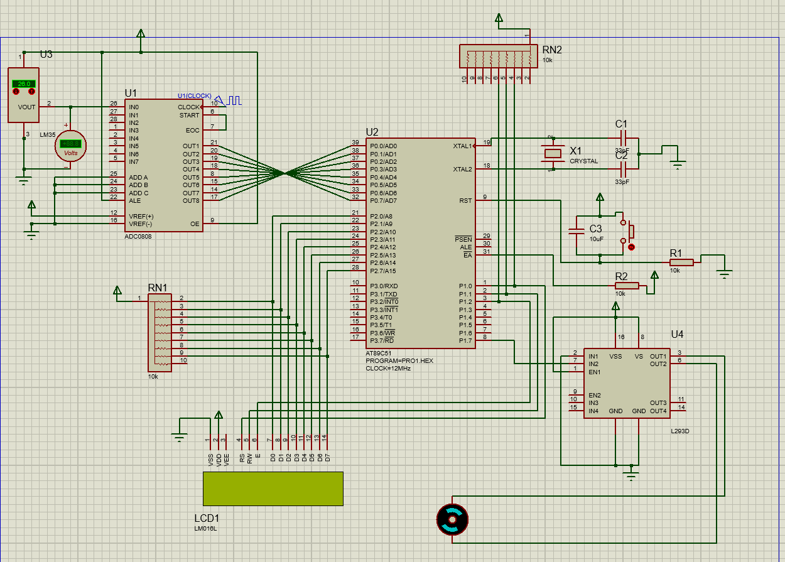
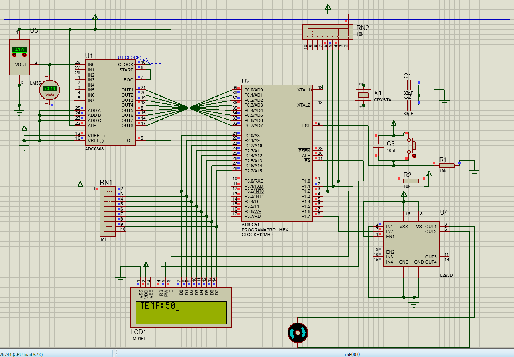
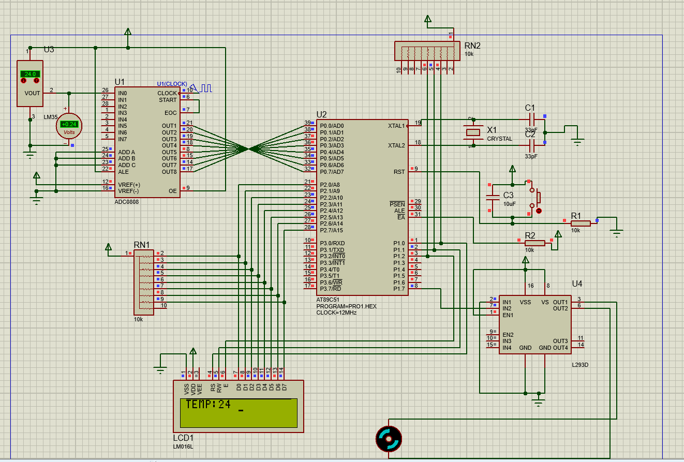
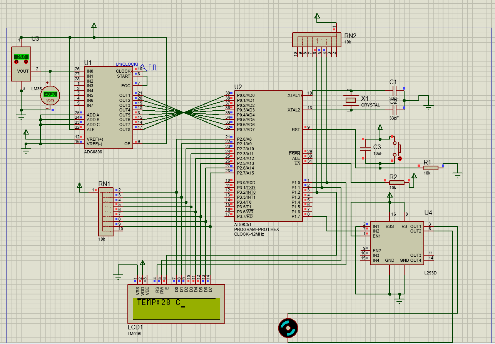

# Temperature control using 8051 microcontroller
This is a basic Data Acquisition System with Assembly Level Program that turns on fan if the temperature exceeds room temperature and displays the current temperature on LCD.

### Components used:
- 8051 Microcontroller
- ADC 0808
- LM35 Temperature Sensor
- DC Motor
- 16x2 LCD 
- L293D Motor Driver

### Tools and IDE:
- 8051 IDE
- PROTEUS Design Suite

### Circuit Diagram and Working:

